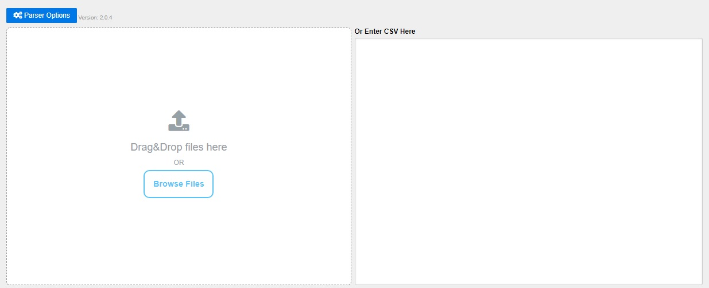
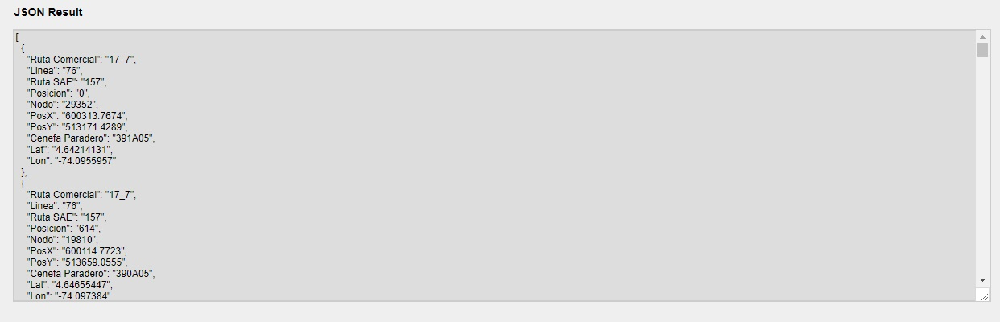

# VIVELAB
- Steven Pardo
- Camilo Pinzón

### Evidencias
- [ ] Presentación 
- [ ] Codigo Fuente

# Prueba Google Maps

Mediante el uso de **Datos Abiertos** mostrar marcadores en el mapa de Google usando como back-end el servicio de Google **Firebase**.

> - [HTML 5](https://www.w3schools.com/html/html5_intro.asp)
> - [CSS 3](https://developer.mozilla.org/es/docs/Web/CSS/CSS3)
> - [JavaScript ES6](http://es6-features.org/)
> - [Maps JavaScript API 3](https://developers.google.com/maps/documentation/javascript/?hl=es-419)
> - [Firebase 5.2.0](https://console.firebase.google.com/)

> **Nota:** Prueba enfocada para el uso del navegador Google Chrome.

## Guía de estilo

https://editorconfig.org/

### CSV a JSON

- Descargar **CSV** de la plataforma [Datos Abiertos Bogotá](http://datosabiertos.bogota.gov.co/).
- Identificar el separador de los campos.
- En https://csv.keyangxiang.com/ subir el CSV descargado.

- En el boton de `Parser Options` ubicado en la esquina superior izquierda, seleccionar el separador (Delimitador por defecto es ",").
- Habilitar la opción *Ignore empty* para evitar generar registros vacíos.

[Imagen seleccion de separador](./assets/options.jpg)

- Al final de la página seleccionar **Download JSON** para descargar el archivo o seleccionar **Review JSON** para previsualizar el archivo.

> **Nota:** Importar el archivo `result.json` en **Firebase Database**.

---

# Otros recursos

- [Cómo agregar Firebase a tu proyecto de JavaScript](https://firebase.google.com/docs/web/setup?authuser=0)
- [Firebase WEB](https://firebase.google.com/docs/database/web/start)
- [Leer y escribir datos en Firebase](https://firebase.google.com/docs/database/web/read-and-write)
